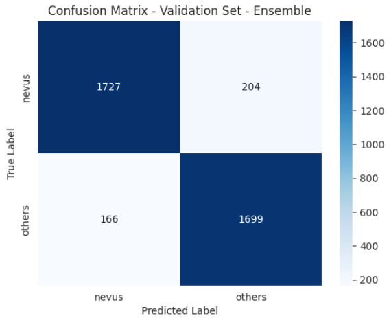

# CADx PROJECT: SKIN LESION CLASSIFICATION CHALLENGE USING CLASSICAL MACHINE LEARNING, AND DEEP LEARNING APPROACHES 

This repository contain the code for the classification of skin lesions through classical machine-learning (ML) approach employing a range of ML classifier models, and deep learning approach to achieve the same task. The approach addresses both two-class and three-class problems, improving classification accuracy despite huge class imbalances and lesion variations.

## DATASET
The challenge dataset includes images from the [HAM10000](https://dataverse.harvard.edu/dataset.xhtml?persistentId=doi:10.7910/DVN/DBW86T), [BCN_20000](https://paperswithcode.com/dataset/bcn-20000), and [MSK_datasets](https://paperswithcode.com/dataset/msk), offering a rich variety of dermatological samples for analysis. The challenge is in two fashion, binary and multiclass. For the binary, the task is to classify 15,000 skin lession images into benign or others. It is a balanced dataset, and no data augmentation was done. The multiclass is highly imbalanced with melanoma containing 2,713 images, Basal cell carcinoma (bcc) - 1,993 images, and Squamous cell carcinoma (scc) - 376 images.

## Data Preprocessing: Vignette Frame and Hair Removal
The `skin_lesion_preprocessing.py` script contains two functions needed for vignette frame (cropped) and Hair removal
* vignette_removal function: Takes an image and a threshold as input parameters. It then detects the threshold where darkening occurs and crops the image accordingly.
* remove_hair function: Accept two input parameters i.e. an image and a structuring element. The function applies morphological black-hat filtering and thresholding operations to remove black hairs.

## Handling Imbalanced Data for the Multiclass challenge
The methods used in handling class imbalance are:
* Data Augmentation: `central cropping, rescaling, and contrast enhancement techniques` 
* Synthetic Minority Over Sampling Technique (SMOTE): check `Challenge2-Best_Model.ipynb`
* Upsampling, and downsampling - check `All_DL_Models_Multi_Classification.ipynb`
* Assigning class weights - check `All_DL_Models_Multi_Classification.ipynb`

## Project Division
This project is in two parts:
* Classical Approach
* Deep Learning Approach

## Classical Approach
The folder `classical_approach` contains the codes for the binary, and multiclass aspect of this project using classical approach. After the preprocessing, features were extracted and trained using ML.

### 1. Feature Extraction
The `classical_approach/skin_lesion_feature_extraction.py` script conatains several defined functions for feature extration. These features are extracted using the ABCD rule, encompassing image `asymmetry,` `border` characteristics, `color` properties, and image `diameter.` These features are:
* Intensity and Color Features: `grayscale intensity, rgb, and hsv`
* Shape Features: `perimeter, area, circularity, compactness, and hu moments`
* Gray Level Co-Occurrence Matrix: `energy, correlation, dissimilarity, homogeneity, contrast, and Angular Second Moment (ASM)`
* Local Binary Pattern: `histogram of lbp values`

### 2. Machine Learning
The `classical_approach` folder conatains the path to the code of best models used for the challenge, this invovles - an ensemble of XGBoost, and Random forest classifier for the binary and multilayer perceptron for the multiclass. The `classical_approach/other_models folder contain codes for several machine learning (ML) models that was tried. In general, all the ML code used includes:
* `XGBoost`
* `Random Forest`
* `SVM Classifier`
* `KNN Classifier`
* `Logistic Regression`
* `AdaBoost`
* `Naive Bayes`
* `Multi Layer Perceptron Classifier`

## Deep Learning Approach
The folder `deep_learning_approach` contains the codes for the binary, and multiclass aspect of this project using deep learning approach. After the preprocessing, several pretrained models were trained implemented which includes:
* `EfficientNet V2 B0 model`
* `DenseNet121/210`
* `Vision Transformer`
* `ResNet50`
* `MobileNet`
* `VGG16`
* `RegNet`
* `InceptionResNetV2`

### Deep Learning Approach using Monai
The `deep_learning_approach/Other_Models_Binary_Classification/Monai_Binary_DL.ipynb` script conatains the implementation of several DenseNet pretrained models using Monai, trained on just 10 epoches.
* `Monai DenseNet121`
* `Monai DenseNet169`
* `Monai DenseNet201`
* `Monai DenseNet264`

The best model for the deep learning approach was from the ensemble of `MobileNet`, and `InceptionResNetV2` and the resulting confusion matrix is shown below for the binary classification:

